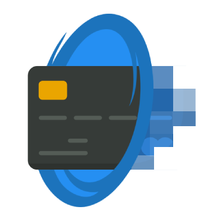

<p align="center">

</p>

# CKO Payment Gateway

[](https://github.com/Diggzinc/CKO.PaymentGateway/actions/workflows/build-and-test.yaml)

**Table of Contents**

- [CKO Payment Gateway](#cko-payment-gateway)
  - [Prerequisites](#prerequisites)
  - [Architecture](#architecture)
  - [Domain and Assumptions](#domain-and-assumptions)
    - [General Assumptions](#general-assumptions)
    - [Data Models](#data-models)
      - [JSON Representations](#json-representations)
  - [The Payment Gateway API](#the-payment-gateway-api)
    - [`POST /api/v1/payments`](#post-apiv1payments)
    - [`GET /api/v1/payments/{payment-id}`](#get-apiv1paymentspayment-id)
    - [`GET /health`](#get-health)
  - [Setup](#setup)
    - [Setup with `dotnet-cli`](#setup-with-dotnet-cli)
      - [Build](#build)
      - [Run Tests](#run-tests)
        - [All Tests](#all-tests)
        - [Specific Category Tests](#specific-category-tests)
        - [Performance Tests](#performance-tests)
      - [Run API](#run-api)
      - [Environment Clean Up](#environment-clean-up)
    - [Setup with `Visual Studio 2022 Community`](#setup-with-visual-studio-2022-community)
      - [Run with `docker-compose` project](#run-with-docker-compose-project)
      - [Run with standalone `CKO.PaymentGateway.Host.Api` project](#run-with-standalone-ckopaymentgatewayhostapi-project)
  - [How to use Payment Gateway API](#how-to-use-payment-gateway-api)
    - [Make requests](#make-requests)
    - [Introduce Payment Failures](#introduce-payment-failures)
  - [Relevant Technical Comments/Considerations](#relevant-technical-commentsconsiderations)
    - [Comments on the Tests](#comments-on-the-tests)
      - [Unit Tests](#unit-tests)
      - [Integration Tests](#integration-tests)
      - [Acceptance Tests](#acceptance-tests)
      - [Architecture Tests](#architecture-tests)
      - [Performance Tests](#performance-tests-1)
    - [Comments on Observability](#comments-on-observability)
      - [Logging](#logging)
      - [Tracing](#tracing)
    - [Comments on Responsibilities](#comments-on-responsibilities)
    - [Comments on Code Style / Architecture](#comments-on-code-style--architecture)
  - [Areas for Improvement](#areas-for-improvement)

## Prerequisites

The following section describes the prerequisites in order to build and run this challenge solution.

**Software Requirements** 

The following list of software is based on the versions I've used to build this challenge, therefore, I would recommend to at least stick with the major version of each one of these.
- `Windows 10`
- `Docker version 20.10.12, build e91ed57` 
- `dotnet 6.0.200-preview.22055.15`
- `Visual Studio Community Version 17.1.0 Preview 4.0` (with `ASP.NET` and web development workload)

**System requirements**

The following `ports` should be available on your local machine, although configurable it's advised to just use the defaults provided.

| Port | Usage                        |
| ---- | ---------------------------- |
| 5342 | PostgreSQL database          |
| 3000 | Acquiring Bank API (Mockoon) |
| 5000 | Payment Gateway API          |

## Architecture

The **Payment Gateway API** solution was made up to run inside a `docker` environment as presented under the following diagram.

<p align="center">

</p>

The solution consists of the following 4 containers:

**database** - container that leverages [PostgreSQL](https://www.postgresql.org/) to hold the stored data for payments. 

**migrations** - container that runs on docker-compose stack startup using [Flyway](https://flywaydb.org/) waiting for the database to be ready then applies the migrations for the necessary schemas (*depends on the database container*). 

**acquiring bank api** - a container that's running [Mockoon CLI](https://mockoon.com/cli/) as a service with pre-baked responses for the required uses cases to the Acquiring Bank.

**payment gateway api** - The Payment Gateway API application built with .NET6 that fulfill's the use cases for the challenge at hand (*depends on the migrations container*).

## Domain and Assumptions

### General Assumptions
After some research by payment cards in [general](https://baymard.com/checkout-usability/credit-card-patterns) and payment gateway [responsibilities](https://en.wikipedia.org/wiki/Payment_gateway), the following assumptions were made:
- Although a payment gateway has many back and forward iterations with the merchant and the acquiring bank, this demo will simulate all those steps in one go on the processing request.
  - Those steps can be seen as records entries for the payment when retrieved;
  - The available record types are `Issued`, `Verifying`, `Verified`, `Authorizing`, `Authorized`, `Processing`, `Processed`, `Failed`.
- The payment gateway solution will **NOT** store the whole payment card information:
  - Only the last 4 digits of the card, **NOT** the whole number ⚠️;
  - The length of the card number;
  - expiry date;
  - holder name;
  - Security code (cvc/cvv) will **NOT** be stored ⚠️.
- In order to interact with the API authentication is required.
  - We assume that the merchant uses a `JWT` token with a claim `merchantId:<guid>`.
  - Authentication is usually used through an authority such as an Identity Service Provider that issues these tokens, but, for demonstration purposes the application will use a self-signed token with symmetric key material `your-256-bit-secret`, therefore, these tokens can be easily created on the [JWT.io](https://jwt.io/) website.
- While the domain model is thoroughly tested, the other tests are mostly for demonstration purposes in order to show evidence of the way to test certain things on an application, offering different viewpoints.
  - A following section will go over the tests and their intended purpose.
  - Given this though, I firmly believe testing is paramount, my father is a carpenter and he always says `measure twice, cut once`. As a rule of thumb I carry this over to testing as well.

### Data Models

The following examples refer to the API models (view models) that are exposed to the user and not the domain models used by the application, which are translated from these view models.

If you want to see an in-depth explanation of the domain models, please refer to the documentation under the `CKO.PaymentGateway.Models` project.

 In that project you can also find the domain constraints such as the allowed length for the number of a card, supported currencies among other things.

#### JSON Representations

<details>
  <summary><b>ProcessPaymentJsonRequest.json</b> (click to <i>expand/collapse</i>)</summary>
  
```json
{
  "card": {
    "number": "1111 1111 1111 1235",
    "securityCode": "111",                
    "expiryDate": "01/27",
    "holder": "John Doe"
  },
  "charge": {
    "currency": "EUR",
    "amount": 0.01
  },
  "description": "AMZN Purchase"
}
```
</details>

<details>
  <summary><b>PaymentJsonResponse.json</b> (click to <i>expand/collapse</i>)</summary>
  
```json
{
  "id": "606077e8-8f06-4f79-a6a1-12e48f3e33a1",
  "card": {
    "number": "**** **** **** 1234",
    "expiryDate": "12/22",
    "holder": "John Doe"
  },
  "charge": {
    "currency": "EUR",
    "amount": 10.20
  },
  "description": "AMZN PURCHASE",
  "records": [
    {
      "id": "4b5ae15e-ff80-44e4-934d-bd59800c7d53",
      "timestamp": "2022-01-24T20:55:21.0000000+00:00",
      "operation": "Issued",
      "metaData": {
        "transactionId": "020caaa5-fbf1-4923-b2f1-957440de9edd"
      }
    },
    {
      "id": "3062c9f7-6db9-4fbb-a8b2-94c2aab55d9c",
      "timestamp": "2022-01-24T20:55:22.0000000+00:00",
      "operation": "Verifying",
      "metaData": {
        "transactionId": "020caaa5-fbf1-4923-b2f1-957440de9edd"
      }
    },
    {
      "id": "e5a92704-d805-4c92-8c5a-308e040cf963",
      "timestamp": "2022-01-24T20:55:23.0000000+00:00",
      "operation": "Verified",
      "metaData": {
        "transactionId": "020caaa5-fbf1-4923-b2f1-957440de9edd"
      }
    },
    {
      "id": "e84c6ebe-7e15-4160-96ad-70de4d1d74c4",
      "timestamp": "2022-01-24T20:55:24.0000000+00:00",
      "operation": "Authorizing",
      "metaData": {
        "transactionId": "020caaa5-fbf1-4923-b2f1-957440de9edd"
      }
    },
    {
      "id": "9d4accc4-7f2a-4886-8db7-fececedc2a8c",
      "timestamp": "2022-01-24T20:55:25.0000000+00:00",
      "operation": "Authorized",
      "metaData": {
        "transactionId": "020caaa5-fbf1-4923-b2f1-957440de9edd"
      }
    },
    {
      "id": "bcbdb2bc-387e-41b7-879c-427c1bc4cd99",
      "timestamp": "2022-01-24T20:55:26.0000000+00:00",
      "operation": "Processing",
      "metaData": {
        "transactionId": "020caaa5-fbf1-4923-b2f1-957440de9edd"
      }
    },
    {
      "id": "94b98612-1fc7-4974-beb9-dc5c56ec0aed",
      "timestamp": "2022-01-24T20:55:27.0000000+00:00",
      "operation": "Processed",
      "metaData": {
        "transactionId": "020caaa5-fbf1-4923-b2f1-957440de9edd"
      }
    }
  ]
}
```
</details>

## The Payment Gateway API

The payment gateway API application consists in 3 different endpoints. 

Two of those to fulfill the challenge presented:
- `POST /api/v1/payments` - to process a payment.
- `GET /api/v1/payments/{{payment-id}}` - to retrieve the payment details.

And one additional endpoint to check the application health:
- `GET /health`

### `POST /api/v1/payments`

The `body` of the request is the same format as the one presented on [JSON Representations](#json-representations) section for the **ProcessPaymentJsonRequest.json**.

Other possible responses can be:
<details>
  <summary><b>404BadRequest.json</b> (click to <i>expand/collapse</i>)</summary>
  
```http
HTTP/1.1 400 Bad Request
Connection: close
Content-Type: application/problem+json; charset=utf-8
Date: Thu, 27 Jan 2022 17:26:46 GMT
Server: Kestrel
Transfer-Encoding: chunked

{
  "type": "https://tools.ietf.org/html/rfc7231#section-6.5.1",
  "title": "One or more validation errors occurred.",
  "status": 400,
  "traceId": "00-4af2c458ee7cfb27d3897607482e1677-50b436574bd173e0-01",
  "errors": {
    "description": [
      "'description' must not be empty."
    ],
    "card.holder": [
      "'holder' must not be empty."
    ],
    "card.number": [
      "'number' (without whitespaces) must be between 14 and 19 characters. You entered 22 characters.",
      "'number' is not in the correct format."
    ],
    "card.expiryDate": [
      "'expiryDate' provided does conform with the allowed format 'mm/yy' or has expired."
    ],
    "card.securityCode": [
      "'securityCode' must be between 3 and 4 characters. You entered 1 characters.",
      "'securityCode' is not in the correct format."
    ],
    "charge.amount": [
      "'amount' is not within the allowed precision for the given 'currency'."
    ],
    "charge.currency": [
      "'currency' provided is not supported."
    ]
  }
}
```
</details>

<details>
  <summary><b>401Unauthorized.json</b> (click to <i>expand/collapse</i>)</summary>
  
```http
HTTP/1.1 401 Unauthorized
Content-Length: 0
Connection: close
Date: Thu, 27 Jan 2022 17:25:04 GMT
Server: Kestrel
WWW-Authenticate: Bearer error="invalid_token"
```
</details>

### `GET /api/v1/payments/{payment-id}`

The usual result of the request is the same format as the one presented on [JSON Representations](#json-representations) section for the **PaymentJsonResponse.json**.

Other possible responses can be:
<details>
  <summary><b>404NotFound.json</b> (click to <i>expand/collapse</i>)</summary>
  
```http
HTTP/1.1 404 Not Found
Connection: close
Content-Type: application/problem+json; charset=utf-8
Date: Thu, 27 Jan 2022 17:24:45 GMT
Server: Kestrel
Transfer-Encoding: chunked
api-supported-versions: 1.0

{
  "type": "https://datatracker.ietf.org/doc/html/rfc7231#section-6.5.4",
  "title": "Payment not found.",
  "status": 404,
  "traceId": "00-54784c50413fb6dbe0278c69ddf18243-5148675ad513f3db-01"
}
```
</details>

<details>
  <summary><b>401Unauthorized.json</b> (click to <i>expand/collapse</i>)</summary>
  
```http
HTTP/1.1 401 Unauthorized
Content-Length: 0
Connection: close
Date: Thu, 27 Jan 2022 17:25:04 GMT
Server: Kestrel
WWW-Authenticate: Bearer error="invalid_token"
```
</details>

### `GET /health`

Example Response:
<details>
  <summary><b>HealthCheck.json</b> (click to <i>expand/collapse</i>)</summary>
  
```json
// 20220127172131
// http://localhost:5000/health

{
  "status": "pass",
  "notes": [
    "TotalDuration: 00:00:00.0593761"
  ],
  "checks": {
    "data-storage": [
      {
        "exception": null,
        "output": "Data storage instance is operational.",
        "status": "pass",
        "duration": "00:00:00.0574901"
      }
    ],
    "acquiring-bank-services": [
      {
        "exception": null,
        "output": "Acquiring bank services are operational.",
        "status": "pass",
        "duration": "00:00:00.0493475"
      }
    ]
  }
}
```
</details>

## Setup

This section describes how can the application be ran in three different ways for commodity purposes.

The ways to use the application are the following:
- Using the `dotnet-cli` through the terminal;
- Using `Visual Studio 2022`:
  - Through the `docker-compose` project;
  - Through the standalone `CKO.PaymentGateway.Host.Api` project.
### Setup with `dotnet-cli`

The lightest form of running the application is through the usage of the `dotnet-cli` command line tool. In order to achieve this please follow the steps below.

#### Build

Build the solution by executing the following commands on your terminal.

```PowerShell
dotnet clean .\CKO.PaymentGateway.Challenge.sln
dotnet restore .\CKO.PaymentGateway.Challenge.sln
dotnet build .\CKO.PaymentGateway.Challenge.sln --no-restore
```

Click on the image to view the **demo**

<p align="center">
<a href="https://asciinema.org/a/464738"></a>
</p>

#### Run Tests

There are multiple ways that the tests can be ran for the application. Select the flavour you want to use.

##### All Tests

If you want to run all the tests, just execute the following command on your terminal.

```powershell
dotnet test .\CKO.PaymentGateway.Challenge.sln
```
> ⚠️ beware that this won't execute the performance tests.

Click on the image to view the **demo**
<p align="center">
<a href="https://asciinema.org/a/464742"></a>
</p>

##### Specific Category Tests

In case you want to run just a subset of tests execute the following command for the test category you want to run.

 ```powershell
 dotnet test --no-build --verbosity normal --filter FullyQualifiedName~.UnitTests CKO.PaymentGateway.Challenge.sln
 ```

 The previous example just executed the `UnitTests` as seen by the `--filter` parameter. The categories supported for this method of test execution are:
 - `UnitTests`
 - `IntegrationTests`
 - `AcceptanceTests`
 - `ArchitectureTests`

Click on the image to view the **demo**
<p align="center">
<a href="https://asciinema.org/a/464743"></a>
</p>

##### Performance Tests

Performance tests are a category on their own since they do not execute with the dotnet test runner but instead are a dotnet application on it's own.

In order to execute them issue the following command on your terminal.

 ```powershell
dotnet run --project ./test/CKO.PaymentGateway.Api.ViewModels.PerformanceTests -c Release
 ```

Click on the image to view the **demo**
<p align="center">
<a href="https://asciinema.org/a/464740"></a>
</p>

#### Run API

In order to run the API, first, the infrastructure needs to be setup. 

This can be done by executing the following command on your terminal.
 ```powershell
docker-compose --profile infrastructure up --no-build --detach
 ```

 After that you can check if the `database` container and the `acquiring-bank-api` container are running with the following command
 ```powershell
docker ps
 ```

 After you've verified that the containers are now running issue the following command to start the application

 ```powershell
 dotnet run --no-build --project .\src\CKO.PaymentGateway.Host.Api\CKO.PaymentGateway.Host.Api.csproj
 ```

Click on the image to view the **demo**
<p align="center">
<a href="https://asciinema.org/a/464741"></a>
</p>

#### Environment Clean Up
To clean up the environment please issue the following command after you've stopped the application.
```powershell
docker-compose down --volumes
```

This will ensure that the `docker-compose` stack is removed along with the volumes associated with it.
### Setup with `Visual Studio 2022 Community`
Before running the solution on visual studio make sure that you've destroyed the `docker-compose` stack if you ran the previous setup method otherwise the solution won't work since the ports will already be assigned.
#### Run with `docker-compose` project

To run the solution on visual studio just select the project `docker-compose` as startup project, launch it and wait for the magic to happen 🧙.

This will automatically launch the `/health` endpoint on your browser. After that appears the application is good to go.

You can then inspect the logs under the `Container Tools Window` in visual studio.

See the image **demo**
<p align="center">

</p>

#### Run with standalone `CKO.PaymentGateway.Host.Api` project

To launch the `CKO.PaymentGateway.Host.Api` as standalone, which is better/faster for development purposes, you can select it has the startup project. 

Before launching it just make sure you do the infrastructure setup described above on [Setup with `dotnet-cli`-> Run API](#run-api).

Also make sure to clean up after you're done by following the [Environment Clean Up](#environment-clean-up) step.

Click on the image to view the **demo**
<p align="center">
<a href="https://asciinema.org/a/464741"></a>
</p>

## How to use Payment Gateway API


### Make requests

In order to use the API Gateway after it's running you can look at the [requests.http](./requests.http) file for reference.

If you want to actually use those requests make sure to use Visual Studio Code with the [REST Client](https://marketplace.visualstudio.com/items?itemName=humao.rest-client) extension.

The file already contains two valid token's to interact with the API in which one user already has data.

If you want to generate your own tokens use the [JWT.io](https://jwt.io/) website with the following payload, change the values accordingly, and use the following secret `your-256-bit-secret` (which is actually the default one the website 😉) 

```json
{   
    "name": "Adidas",
    "merchantId": "ed962527-eb35-44a9-9c09-b75af6c84ac2"
}
```

### Introduce Payment Failures

In order to introduce payment failures you want to change the Acquiring Bank API mocks. 

For that, you can use the [Mockoon](https://mockoon.com/) Client in order to change the [acquiring-bank-mock-api.json](./acquiring-bank-mock-api.json) file.

Just change the response types from the `2xx` range to another range, for ex.: `4xx` range for a given endpoint and then try to issue a payment.

## Relevant Technical Comments/Considerations

This section shows a collection of some thoughts I would like to convey but were not adequate to be included in the other sections.
### Comments on the Tests

As mentioned previously, I firmly believe testing is paramount, my father is a carpenter and he always says `measure twice, cut once`. As a rule of thumb I carry this over to testing as well.

While this holds true to my viewpoints about software development the same could not be done thoroughly for the time frame of delivery of this demo compared to the whole scope of the project.

Therefore the following comments showcase the main points I would like to convey for each test suite type and why they are important.

#### Unit Tests

These are the conventional unit tests that any developer should be familiar with. The only thing to point out is the usage of libraries such as `FluentAssertions` and `NSubstitute` to improve the code readability/maintainability.

> 🔎 see [FluentAssertions](https://fluentassertions.com/)
>
> 🔎 see [NSubstitute](https://nsubstitute.github.io/)

#### Integration Tests

The usage of Integration Tests in the scope of this project was to showcase the integration of modules that actually communicate with external systems (both the database and the Acquiring Bank API).

In order to achieve this, two approaches were used both leveraging the `XUnit` `ICollectionFixture<T>`.

The **database** integration was achieved by spinning up an ephemeral `docker-compose` stack with both the `database container` and the `migrations container`. The stack would be launched automatically at the start of the tests, seeded with data and then the tests would start as soon as the stack was considered `ready`.

The **acquiring bank api** was integrated through the usage on an ephemeral `WireMock Server` where the request matching was mutated according to the use cases for the tests. This was done in order to mutate the responses to inject errors of the payment process.

> 🔎 see [WireMock.NET](https://github.com/WireMock-Net/WireMock.Net)
>
> 🔎 see [FluentDocker](https://github.com/mariotoffia/FluentDocker)

#### Acceptance Tests

The purpose of this test suite is to test the application in a Behavior Driven Design (**BDD**) approach.

Levering SpecFlow we can write tests that target the actual Use Cases while writing them in a common language that is understandable by both technical and non-technical people.

> 🔎 see [SpecFlow](https://specflow.org/)

The implemented test suite leverages the usage of the dotnet `WebApplicationFactory` which emulates the actual instance of the service, while being capable of overriding certain dependencies.

In this demo one of the main reasons to use `EF Core 6` was to be able to switch the `dbcontext` to an `InMemory` implementation so we could seed the data to our own accord in order to fulfill the use cases for the tests while not requiring to use extensive mocking of the objects.
#### Architecture Tests
The goal of the architecture tests suite is to ensure the cohesion of a architecture principles when it comes to application layering.

With this type of test suite we can check dependencies between classes, members, interfaces, and more and assert if there is some rule broken on code structure.
>  🔎 see [NetArchTest](https://github.com/BenMorris/NetArchTest) 
#### Performance Tests

While the usage of performance tests in the context of this demo was to showcase the difference in performance between two approaches that generate the same end result, my expectation for this test suite is to monitor application blocks that are crucial to the application critical use cases.

With a targeted suite of performance tests we can pinpoint degradation or improvements of the whole application and make more informed decisions, if issues arise.

> 🔎 see [BenchmarkDotNet](https://benchmarkdotnet.org/articles/overview.html)

The following table just shows the result of the performance tests for this demo, for curiosity sake.

``` ini

BenchmarkDotNet=v0.13.1, OS=Windows 10.0.19042.1466 (20H2/October2020Update)
Intel Core i7-9750H CPU 2.60GHz, 1 CPU, 12 logical and 6 physical cores
.NET SDK=6.0.200-preview.21617.4
  [Host]   : .NET 6.0.1 (6.0.121.56705), X64 RyuJIT
  .NET 6.0 : .NET 6.0.1 (6.0.121.56705), X64 RyuJIT

Job=.NET 6.0  Runtime=.NET 6.0  

```
|                         Method |       Mean |   Error |  StdDev |      Min |        Max |     Median | Kurtosis | Ratio |  Gen 0 | Allocated |
|------------------------------- |-----------:|--------:|--------:|---------:|-----------:|-----------:|---------:|------:|-------:|----------:|
|       ToMaskedCardJsonResponse | 1,004.9 ns | 9.69 ns | 8.09 ns | 994.0 ns | 1,020.9 ns | 1,003.9 ns |    2.224 |  1.00 | 0.0973 |     616 B |
| BetterToMaskedCardJsonResponse |   199.9 ns | 4.03 ns | 8.13 ns | 186.4 ns |   214.1 ns |   199.2 ns |    1.445 |  0.19 | 0.0253 |     160 B |


### Comments on Observability

While I consider observability one cornerstone of a good application the time frame did not allow to go too much in-depth in it therefore they are just shown as raw console outputs. In the two following subsections I will showcase the intent I had for them and why they didn't go through in the demo.

#### Logging

While the application does have logging the logs being outputted to the console a a human readable format.

When it comes to logging the application principle is for the logs to be processed in an out-of-process fashion with as much context as possible therefore the logs should be way more verbose and adapted to a more machine friendly format, such as JSON. Serilog would cover that easily.

The choice between rolling files or console output would depend on the deployment infrastructure, if we were to be on Kubernetes console logging would be the better approach since Kubernetes would then handle the writing to disk.

After that the files would be collected by a log processor/forwarder such as FluentBit (be it a sidecar or a DaemonSet on Kubernetes) and sent to an aggregator which would then parse the data and sink it to the desired platform (ex.: Elasticsearch).

This approach was not showcased on the demo, because it would make the `docker-compose` stack a little bit too heavy for the intended purpose, but it could be achieved with ease (been there, done that 😜).

#### Tracing

The same rationale applied to the logs would work for the tracing, the collectors would be working out-of-process and the exporters would send out the data to them. This was also not included in the `docker-compose` stack due to the added burden of execution.
### Comments on Responsibilities

While the application models have some opinionated regarding the format of that that they support, as mentioned in the code comments of those classes, I firmly believe that model validation should be delegated to actual services.

See for example the card number conditions to infer if it's a `Visa`, `MasterCard` and so on, there is to much volatility in that and it's too error prone to be captured under the responsibility of the Payment Gateway.

While that could still be imported code packages in order to not pay the performance penalty of network access to an external service, I think the demo that I've presented does more that it should do in that regard, but again it was to showcase stuff.

### Comments on Code Style / Architecture

While trying to have an hexagonal approach to application architecture, I'm fond of the approach that Microsoft has been having with their NuGet packages. 

Making the packages as granular as possible while keeping the implementation and abstractions separated from each project. 

I've seen too many projects creating an `Infrastructure` project and shoving every dependency in there such as `Redis`, `RabbitMQ`, `AWS` stuff and so on. 

That's in my point of view a huge error since it breaks the application modularity.
That does not necessary mean we have to create a abstraction over an already existing interface, because with the `Decorator Pattern` we can salvage that for example.

## Areas for Improvement
**CI/CD**

While this project has a github actions workflow, it's just... close to nothing.

**Resiliency**

There is none, only the `/health` endpoint that could be used by the consumers to not hammer away at our application. 

But the whole idea would be to had circuit breaking mechanisms to fast respond to requests if the application is in a degraded state. For example if the acquiring bank was down we could still serve the payment detail requests without an issue, but we could short circuit the payment processing and deliver a fast response saying that the request could not be fulfilled while no stressing the already poorly performant Acquiring Bank API.

Same thing would work for retries in case transient failures to requests with an exponential backoff before opening the circuit.

**Cloud Provider Deployments**

Did not touch on that, even though AWS is my strong suit, I would at least try to showcase the usage of **CDK** to delivery clean, versioned and application-like Infrastructure as Code (**IaC**). 

**Parameters/Secrets for configuration**

The configuration it done through environment variables on this demo, while that's ok in the context of containers and Kubernetes. I would have liked to have them with more dynamism through the usage of a dedicated service for the use cases (ex.: `ParameterStore` and `SecretsManager`).

**Authentication/Authorization**

It's done through just the symmetric key usage and the claim based authorization on this demo. Then again I believe this should be done through external services such as a proper Identity Provider for token issuing and a dedicated service for Authorization such as `Open Policy Agent`.

**Many other things**

As the title says... many other things... this was just a one week project, so there is a lot that is missing.


